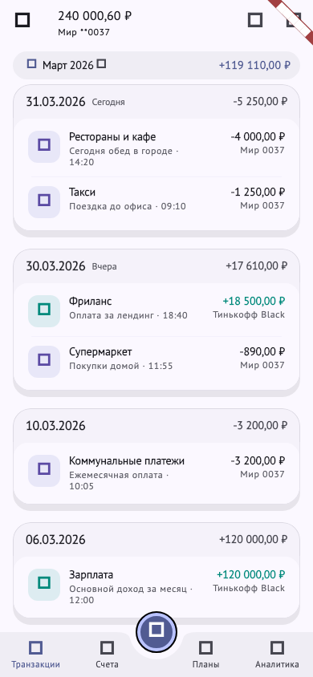
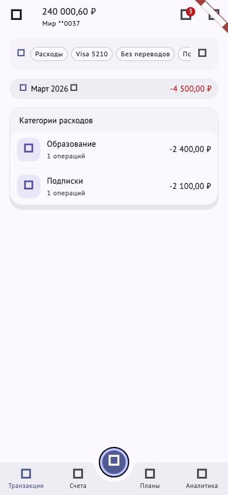
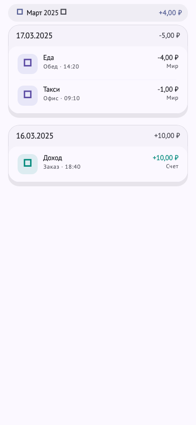
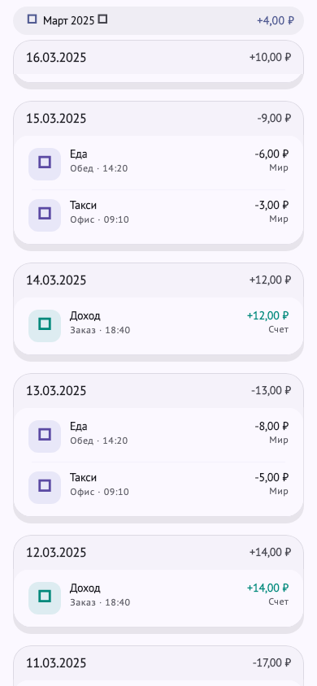
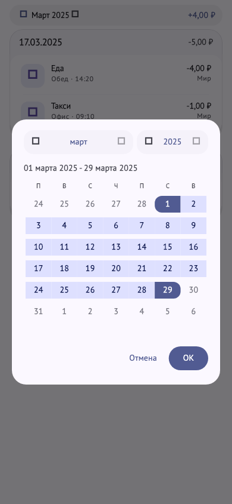

# Визуальные эталоны экрана транзакций

Документ фиксирует текущий визуальный вид экрана транзакций.
Он опирается на golden-снимки из `test/goldens/goldens` и должен обновляться
вместе с изменениями UI.

## Основной экран в shell

Снимок покрывает реальный экран `/app/transactions` внутри `MainPage`:
- app bar с action-кнопками
- список транзакций
- FAB
- нижнюю навигацию



Golden-тест:
- `test/goldens/transactions_screen_visual_regression_test.dart`

## Экран с активными фильтрами

Снимок фиксирует состояние после применения фильтров:
- активные filter chips под app bar
- badge со счётчиком фильтров
- группировку `По категориям`



Golden-тест:
- `test/goldens/transactions_screen_visual_regression_test.dart`

## Внутренние состояния списка

Эти widget-level снимки страхуют ключевые части контента:
- базовый overview списка
- pinned day header при scroll
- диалог выбора периода







Golden-тест:
- `test/goldens/visual_regression_test.dart`

## Как обновлять

Для route-level снимков:

```bash
flutter test --update-goldens \
  test/goldens/transactions_screen_visual_regression_test.dart
```

Для widget-level снимков:

```bash
flutter test --update-goldens test/goldens/visual_regression_test.dart
```
